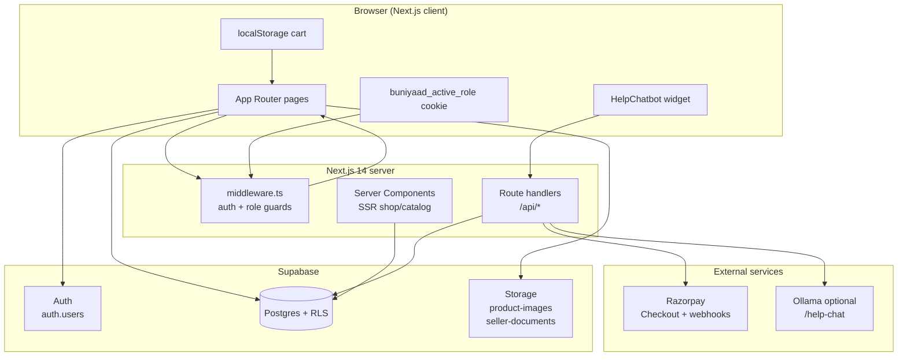
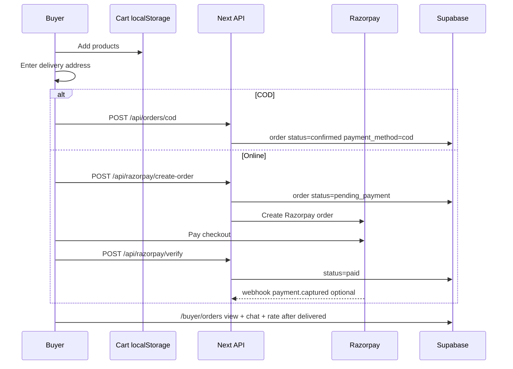
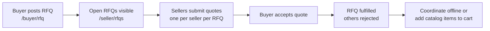

# Buniyaad — Building Material Marketplace (MVP)

B2B/B2C marketplace for building materials in **Bihar**. Buyers browse a **district-aware** catalog, checkout with **Razorpay** or **COD**, post bulk **RFQs**, and track orders. Sellers run a **Shop Studio** (photos, map, delivery coverage, offers, payout details), list products, fulfill orders, and quote on requirements.

**Stack:** Next.js 14 (App Router) · Supabase (Postgres + Auth + Storage + RLS) · Razorpay · Tailwind · Vercel · optional Ollama (help bot)

---

## Features at a glance

| Area | What’s built |
|------|----------------|
| **Public** | Landing, catalog filters (district delivery), seller directory, public shop pages (gallery, map, delivery area, offers, certified ratings, tap-to-call) |
| **Buyer** | Guest cart, login-at-checkout, COD + online pay, order tracking, per-order chat, certified shop ratings, RFQ + accept quotes |
| **Seller** | Shop Studio (delivery coverage: All Bihar / district / city / selected districts), product CRUD + bulk add (Bihar units), all order states, order chat, RFQs, UPI/bank payout |
| **Payments** | Razorpay test/live, webhook backstop, seller payout details (Route-ready), COD path |
| **Admin** | Secret `/internal/{ADMIN_PATH}` console — verify sellers, GMV, categories CRUD |
| **Help** | Bottom-right **Buniyaad Help** chat widget — FAQ answers always; optional Ollama for open questions; friendly “LLM down” message when AI unavailable |
| **Auth** | One email → buyer + seller profiles; active role cookie; `/choose-role` |

---

## System architecture



### Request flow (simplified)

1. **Middleware** (`middleware.ts`) — session check, role cookie enforcement, admin path slug validation (`/internal/{ADMIN_PATH}`; `/admin/*` → 404).
2. **Server components** — public catalog, seller shop, buyer orders (SSR + Supabase server client).
3. **Client components** — cart, seller dashboards, Shop Studio, order chat, checkout (Supabase browser client + API routes).
4. **API routes** — COD order, Razorpay create/verify/webhook, help chat (Ollama or FAQ fallback).

### Role model

- One `auth.users` row can have **multiple `profiles`** rows (`buyer`, `seller`, `admin`) — unique on `(user_id, role)`.
- **`buniyaad_active_role`** cookie (+ localStorage) picks buyer vs seller mode when both exist.
- Seller mode disables cart; buyer mode blocks `/seller/*` and vice versa (redirect to `/choose-role`).

---

## Entity relationship diagram

```mermaid
erDiagram
  AUTH_USERS ||--o{ PROFILES : "user_id"
  PROFILES ||--o{ PRODUCTS : "seller_id"
  PROFILES ||--o{ ORDERS_BUYER : "buyer_id"
  PROFILES ||--o{ ORDERS_SELLER : "seller_id"
  PROFILES ||--o| SELLER_PAYOUT_DETAILS : "seller_id"
  PROFILES ||--o{ SELLER_OFFERS : "seller_id"
  PROFILES ||--o{ SELLER_RATINGS_SELLER : "seller_id"
  PROFILES ||--o{ SELLER_RATINGS_BUYER : "buyer_id"
  PROFILES ||--o{ QUOTES : "seller_id"
  PROFILES ||--o{ RFQS : "buyer_id"
  PROFILES ||--o{ ORDER_MESSAGES : "sender_profile_id"

  CATEGORIES ||--o{ CATEGORIES : "parent_id"
  CATEGORIES ||--o{ PRODUCTS : "category_id"
  CATEGORIES ||--o{ RFQS : "category_id"

  ORDERS ||--o{ ORDER_MESSAGES : "order_id"
  ORDERS ||--o{ SELLER_RATINGS : "order_id"
  RFQS ||--o{ QUOTES : "rfq_id"

  AUTH_USERS {
    uuid id PK
    text email
  }

  PROFILES {
    uuid id PK
    uuid user_id FK
    text role "buyer|seller|admin"
    text business_name
    text phone
    text district city pincode address
    boolean verified
    boolean accepts_cod accepts_online
    boolean payout_setup_complete
    text delivery_scope "all_bihar|my_district|my_city|custom_districts"
    jsonb delivery_districts
    jsonb shop_photo_urls
    text aadhaar_status
    numeric map_lat map_lng
  }

  SELLER_PAYOUT_DETAILS {
    uuid seller_id PK_FK
    text upi_id
    text account_name bank_name account_number ifsc
    text razorpay_linked_account_id
    boolean setup_complete
  }

  CATEGORIES {
    uuid id PK
    text name slug
    uuid parent_id FK
  }

  PRODUCTS {
    uuid id PK
    uuid seller_id FK
    uuid category_id FK
    text name unit
    numeric price
    int stock
    text pincode "optional legacy; delivery is shop-level"
    boolean active
  }

  ORDERS {
    uuid id PK
    uuid buyer_id FK
    uuid seller_id FK
    jsonb items
    numeric total
    text status
    text payment_method "online|cod"
    text delivery_address
    text razorpay_order_id razorpay_payment_id
  }

  ORDER_MESSAGES {
    uuid id PK
    uuid order_id FK
    uuid sender_profile_id FK
    text body
  }

  RFQS {
    uuid id PK
    uuid buyer_id FK
    uuid category_id FK
    text description quantity pincode
    text status "open|closed|fulfilled"
  }

  QUOTES {
    uuid id PK
    uuid rfq_id FK
    uuid seller_id FK
    numeric price
    text status "pending|accepted|rejected"
  }

  SELLER_OFFERS {
    uuid id PK
    uuid seller_id FK
    text title
    jsonb product_ids
    boolean active
  }

  SELLER_RATINGS {
    uuid id PK
    uuid seller_id FK
    uuid buyer_id FK
    uuid order_id FK
    int rating
    boolean certified
  }
```

> **Note:** `seller_payout_details` is **private** (RLS: seller + admin only). Bank/UPI never exposed on public shop pages.

---

## Core business flows

### Catalog checkout (per seller)



### RFQ / quote flow (separate from catalog checkout)



### Order status (seller advances after payment)

| Status | Meaning | Typical next |
|--------|---------|--------------|
| `pending_payment` | Online checkout started, not paid | — (buyer pays or abandons) |
| `paid` | Razorpay verified | `confirmed` |
| `confirmed` | Seller accepted / COD placed | `dispatched` |
| `dispatched` | Out for delivery | `delivered` |
| `delivered` | Complete | buyer can rate shop |
| `cancelled` | Manual only (no UI yet) | — |

COD orders skip `pending_payment` / `paid` and start at **`confirmed`**.

---

## Route map

| Route | Auth | Role | Purpose |
|-------|------|------|---------|
| `/` | — | — | Landing + hero carousel |
| `/catalog` | — | — | Product browse + filters |
| `/sellers`, `/sellers/[id]` | — | — | Seller directory + public shop |
| `/cart` | optional | buyer* | Cart + checkout |
| `/login`, `/signup` | — | — | Auth |
| `/choose-role` | ✓ | — | Buyer vs seller picker |
| `/buyer/orders` | ✓ | buyer | Orders, chat, ratings |
| `/buyer/rfq` | ✓ | buyer | Post RFQ, accept quotes |
| `/seller/profile` | ✓ | seller | Shop Studio |
| `/seller/dashboard` | ✓ | seller | Products |
| `/seller/orders` | ✓ | seller | Fulfill + chat |
| `/seller/rfqs` | ✓ | seller | Quote on RFQs |
| `/internal/{ADMIN_PATH}` | ✓ | admin | Ops dashboard |
| `/internal/{ADMIN_PATH}/categories` | ✓ | admin | Category CRUD |
| `/internal/{ADMIN_PATH}/login` | — | — | Admin login |

\*Seller active role redirects to `/choose-role` for `/cart` and buyer routes.

### API routes

| Endpoint | Method | Purpose |
|----------|--------|---------|
| `/api/orders/cod` | POST | COD order → `confirmed` |
| `/api/razorpay/create-order` | POST | Internal order + Razorpay order |
| `/api/razorpay/verify` | POST | Signature verify → `paid` |
| `/api/razorpay/webhook` | POST | `payment.captured` backstop |
| `/api/help-chat` | GET/POST | FAQ + optional Ollama |

---

## Project structure

```
app/
  layout.tsx                 # Root layout + HelpChatbot
  page.tsx                   # Landing
  middleware.ts              # Auth, role, admin path guards
  catalog/                   # Public product catalog
  sellers/, sellers/[id]/    # Directory + shop page
  cart/                      # Cart + checkout
  choose-role/               # Dual-role picker
  (auth)/login, signup/      # Auth pages
  buyer/orders, buyer/rfq/   # Buyer flows
  seller/
    layout.tsx               # Persistent seller shell + session cache
    loading.tsx, template.tsx
    profile/                 # Shop Studio
    dashboard/               # Products
    orders/, rfqs/           # Fulfillment + quotes
  internal/[slug]/           # Admin console
  api/orders/cod/
  api/razorpay/*
  api/help-chat/

components/
  Navbar, Footer, HeroCarousel
  ProductCard, CatalogFilters, SellerCard, SellerFilters
  SellerLayout, SellerTabNav, SellerShell, SellerPublicView
  SellerPayoutFields, SellerOfferEditor, DeliveryCoverageFields, ShopMapEmbed
  OrderChat, RateSellerForm, BuyerOrdersList, HelpChatbot
  UnitSelectField, BulkAddGuide
  admin/AdminCategoryManager

lib/
  supabase/client.ts, server.ts   # Browser singleton + SSR client
  cart.ts                         # localStorage cart
  profiles.ts, session-role.ts    # Multi-profile + active role
  seller-session.tsx              # Cached seller auth across tabs
  payout.ts, help-chat.ts, delivery-scope.ts, product-units.ts, maps.ts, shop-social.ts
  razorpay.ts, category-match.ts, sellers.ts, admin.ts

supabase/
  schema.sql                      # Full DB (new projects)
  demo_seed.sql                   # Optional demo data
  patches/                        # Incremental migrations
```

---

## Environment variables

Copy `.env.local.example` → `.env.local`.

| Variable | Required | Purpose |
|----------|----------|---------|
| `NEXT_PUBLIC_SUPABASE_URL` | ✓ | Supabase project URL |
| `NEXT_PUBLIC_SUPABASE_ANON_KEY` | ✓ | Public anon key (client + RLS) |
| `SUPABASE_SERVICE_ROLE_KEY` | ✓ | Server-only (keep secret) |
| `NEXT_PUBLIC_RAZORPAY_KEY_ID` | ✓ | Razorpay checkout (test or live) |
| `RAZORPAY_KEY_SECRET` | ✓ | Server-side Razorpay |
| `RAZORPAY_WEBHOOK_SECRET` | recommended | Webhook signature verify |
| `ADMIN_PATH` | ✓ | Secret slug for `/internal/{slug}` |
| `OLLAMA_BASE_URL` | optional | e.g. `http://127.0.0.1:11434` |
| `OLLAMA_MODEL` | optional | e.g. `llama3.2` (default in code) |

---

## Database setup

### New project

1. Supabase → **SQL Editor** → run entire `supabase/schema.sql`.
2. Optional: `supabase/demo_seed.sql` for demo sellers/products.
3. Create admin profile (see comment at bottom of `schema.sql`).

### Existing project (patches)

Run in order if the DB predates a feature:

| Patch | Adds |
|-------|------|
| `patches/seller_profile_fields.sql` | Shop photos, Aadhaar fields |
| `patches/admin_categories_rls.sql` | Admin category policies |
| `patches/shop_features.sql` | Map, payment toggles, offers, ratings |
| `patches/order_chat_certified_ratings.sql` | Order chat + certified ratings |
| `patches/seller_payout_details.sql` | UPI/bank settlement table |
| `patches/seller_delivery_scope.sql` | Shop-level delivery coverage; optional `products.pincode` |

### Storage buckets

| Bucket | Access | Use |
|--------|--------|-----|
| `product-images` | **Public** read | Product images, shop gallery |
| `seller-documents` | **Private** (owner + admin) | Aadhaar, registration, certificates |

Storage policies are documented at the bottom of `supabase/schema.sql`.

---

---

## Quick start (local)

```bash
npm install
cp .env.local.example .env.local   # fill all required values
npm run dev
```

Open http://localhost:3000

---

## Deploy to production (step-by-step)

Recommended stack: **Vercel** (app) + **Supabase** (DB/auth/storage) + **Razorpay** (payments). Ollama is optional and usually **not** on Vercel (use FAQs only, or host Ollama separately).

### Step 1 — Supabase (~10 min)

1. Create project at https://supabase.com
2. **SQL Editor** → run entire `supabase/schema.sql` (new DB)  
   **OR** if DB already exists, run patches in order (see table above), including:
   - `shop_features.sql`
   - `order_chat_certified_ratings.sql`
   - `seller_payout_details.sql`
   - `seller_delivery_scope.sql`
3. **Storage** → create buckets:
   - `product-images` (public read)
   - `seller-documents` (private)
   - Apply policies from comments at bottom of `schema.sql`
4. **Settings → API** → copy **URL**, **anon key**, **service role key**

### Step 2 — Razorpay (~5 min)

1. https://dashboard.razorpay.com → **Test mode** API keys
2. Note **Key ID** + **Key Secret**
3. After deploy: **Settings → Webhooks** →  
   `https://YOUR-DOMAIN.vercel.app/api/razorpay/webhook`  
   Event: `payment.captured` → copy **Webhook secret**
4. For real money: complete KYC, switch to **Live** keys on production

### Step 3 — Environment variables

Copy `.env.local.example` → `.env.local` locally. On Vercel: **Project → Settings → Environment Variables** — add **all** of these for **Production** (and Preview if you want):

| Variable | Notes |
|----------|--------|
| `ADMIN_PATH` | Long random slug, e.g. `buniyaad-ops-k9m2x7` |
| `NEXT_PUBLIC_SUPABASE_URL` | From Supabase |
| `NEXT_PUBLIC_SUPABASE_ANON_KEY` | From Supabase |
| `SUPABASE_SERVICE_ROLE_KEY` | **Secret** — server only |
| `NEXT_PUBLIC_RAZORPAY_KEY_ID` | `rzp_test_…` or live |
| `RAZORPAY_KEY_SECRET` | **Secret** |
| `RAZORPAY_WEBHOOK_SECRET` | From Razorpay webhook |
| `OLLAMA_BASE_URL` | Optional — skip on Vercel unless you host Ollama elsewhere |
| `OLLAMA_MODEL` | Optional — default `llama3.2` |

Generate a strong `ADMIN_PATH` before first deploy. Your admin login will be:  
`https://YOUR-DOMAIN.vercel.app/internal/YOUR_ADMIN_PATH/login`

### Step 4 — Push to GitHub

```bash
git add .
git commit -m "Ready for production deploy"
git push origin main
```

### Step 5 — Vercel deploy (~5 min)

1. https://vercel.com → **Add New Project** → import your GitHub repo
2. Framework: **Next.js** (auto-detected)
3. Paste **all env vars** from Step 3
4. **Deploy**
5. After first deploy, update Razorpay webhook URL to your real Vercel domain

### Step 6 — Post-deploy smoke test

Run through the [pre-production checklist](#pre-production-test-checklist) on your live URL. Minimum:

- [ ] `/catalog` loads, district filter works
- [ ] Sign up buyer + seller
- [ ] Seller: Shop Studio → delivery coverage + payout + add product
- [ ] Buyer: add to cart → COD or Razorpay test payment
- [ ] **Buniyaad Help** widget bottom-right → FAQ question works
- [ ] Admin: create admin profile in Supabase (`profiles.role = 'admin'`), login at `/internal/{ADMIN_PATH}/login`

### Step 7 — Go live (when ready)

1. Razorpay: switch to **Live** keys in Vercel env vars
2. Re-create webhook for production domain
3. Onboard real sellers; verify shops in admin console

---

## Local development reference

### Supabase

See [Database setup](#database-setup) above.

### Razorpay

Test cards/UPI in Razorpay docs. Webhook optional locally (use ngrok if testing webhooks).

### Help chatbot (Ollama)

```bash
# Install Ollama, then:
ollama pull llama3.2
ollama serve
```

In `.env.local`:

```env
OLLAMA_BASE_URL=http://127.0.0.1:11434
OLLAMA_MODEL=llama3.2
```

**Behavior:** FAQ keyword questions → instant answers. Open-ended questions → Ollama if up; otherwise “robot is feeling sick / LLM down” + quick-pick suggestions.

---

## Demo-ready (after deploy)

- **Admin:** sign up, set `profiles.role = 'admin'` in Supabase, visit `/internal/{ADMIN_PATH}/login`.
- **Sellers:** onboard 3–5 real shops via `/signup?role=seller`, complete Shop Studio (delivery + payout) + products.
- **Script:** catalog → cart → Razorpay test pay → seller orders → RFQ quote flow.

---

## Pre-production test checklist

Use this before going live. Admin console: `/internal/{ADMIN_PATH}`. `/admin/*` always 404.

### Public browsing
- [ ] `/` — hero, carousel links, buyer/seller CTAs
- [ ] `/catalog` — filters (category, **deliver-to district**, search, sort, verified-only), add to cart as guest
- [ ] `/sellers` — directory filters (shop district, **delivers to**, type, verified)
- [ ] `/sellers/[id]` — shop page: gallery, map, **delivery area badge**, COD/online badges, offers, products, tap-to-call, certified ratings
- [ ] `/cart` — works logged out; checkout prompts login

### Auth & roles
- [ ] `/signup?role=buyer` and `/signup?role=seller`
- [ ] Same email → add second role (buyer + seller)
- [ ] `/login` with `next=` redirect (e.g. back to `/cart`)
- [ ] Dual-role login → role picker or `/choose-role`
- [ ] Admin account blocked on public `/login`
- [ ] `/choose-role` sets `buniyaad_active_role` cookie; navbar role switch works
- [ ] Seller mode → cart disabled on product cards
- [ ] Logout clears session + role cookie

### Buyer flows
- [ ] Cart: add, update qty, remove, multi-seller groups
- [ ] Checkout: delivery address required
- [ ] **COD** — seller accepts COD → order `confirmed` → `/buyer/orders`
- [ ] **COD blocked** — seller disabled COD → error at checkout
- [ ] **Online** — Razorpay → `/api/razorpay/verify` → status `paid`
- [ ] **Online blocked** — seller has no payout setup → online hidden; API rejects
- [ ] Abandoned payment → order stays `pending_payment`; seller sees it
- [ ] `/buyer/orders` — status badges, COD tag, order chat (not on `pending_payment`), rate seller after `delivered`
- [ ] `/buyer/rfq` — post requirement, view quotes, accept quote (RFQ → `fulfilled`)

### Seller flows
- [ ] `/seller/profile` — Shop Studio: storefront, **delivery coverage**, gallery, map, **payments + UPI/bank payout**, offers, verify docs
- [ ] Customer preview tab matches public shop
- [ ] **Payout details** — UPI and/or bank required before enabling online pay
- [ ] `/seller/dashboard` — single add, bulk add (no per-product pincode), edit, hide/show, delete, image upload
- [ ] `/seller/orders` — all orders (paid, COD, pending payment), status advance, order chat, call buyer
- [ ] `/seller/rfqs` — open RFQs, submit quote (once per RFQ)
- [ ] Seller tab switching — layout persists, skeletons on load

### Payments API
- [ ] `POST /api/orders/cod` — creates `confirmed` COD order; checks `accepts_cod`
- [ ] `POST /api/razorpay/create-order` — creates `pending_payment` order; checks `accepts_online` + `payout_setup_complete`
- [ ] `POST /api/razorpay/verify` — valid signature → `paid`; invalid → 400
- [ ] `POST /api/razorpay/webhook` — `payment.captured` idempotent on `pending_payment`

### Admin (`/internal/{ADMIN_PATH}`)
- [ ] Wrong slug → 404; `/admin/*` → 404
- [ ] Login — admin profile only
- [ ] Dashboard — seller count, paid-order GMV, toggle seller `verified`, recent orders/RFQs
- [ ] `/categories` — CRUD; block delete if children or products/RFQs use category

### Help chatbot
- [ ] **Buniyaad Help** card bottom-right on public/buyer/seller pages (hidden on `/internal/*`)
- [ ] “How can I help you?” launcher opens chat panel
- [ ] FAQ quick-picks and keyword questions work **without** Ollama
- [ ] Open-ended question + no Ollama → “robot is sick / LLM down” message + suggestions
- [ ] With `OLLAMA_BASE_URL` set + Ollama running → AI replies for open questions

### Security & edge cases
- [ ] Unauthenticated `/seller/*`, `/buyer/orders`, `/buyer/rfq` → `/login`
- [ ] Wrong role cookie → `/choose-role?next=...`
- [ ] RLS: users cannot read others’ orders, messages, or payout bank details
- [ ] `seller_payout_details` — only seller + admin can read (not public)
- [ ] Stock not auto-decremented on order (known MVP gap)
- [ ] Storage: `product-images` (public), `seller-documents` (private)

### Database patches (existing DBs)
- [ ] `supabase/patches/shop_features.sql`
- [ ] `supabase/patches/order_chat_certified_ratings.sql`
- [ ] `supabase/patches/seller_payout_details.sql`
- [ ] `supabase/patches/seller_delivery_scope.sql`

### Env vars on production
- [ ] All required vars from table above
- [ ] `OLLAMA_*` optional

---

## What's intentionally NOT in this MVP

- Native mobile apps (responsive web / PWA-ready)
- Automated delivery/logistics tracking
- **Fully automated Razorpay Route payouts** (sellers add UPI/bank now; manual settlement until Route is wired)
- Seller KYC automation (admin verifies; Aadhaar upload is self-serve)
- Push notifications, SMS alerts
- Auto stock decrement on order
- Order cancel UI (`cancelled` status exists in schema only)

## Known MVP simplifications

- **One checkout per seller** — cart groups items by seller; each group is a separate order.
- **Delivery filter** — district-based (“delivers to”), not geospatial radius. Sellers set coverage once in Shop Studio.
- **Payments** — collected on platform Razorpay account; settlement uses saved seller payout details until Route is integrated.
- **Admin auth** — role flag on profile + secret URL; no separate SSO (fine for solo founder).

---

## Docker (optional self-host)

For VPS / Railway / Render — **not needed for Vercel** (Vercel builds without Docker).

```bash
cp .env.local.example .env.local   # fill values
docker compose up --build
```

App: http://localhost:3000

**With local Ollama for help bot:**

```bash
# In .env.local:  OLLAMA_BASE_URL=http://ollama:11434
docker compose --profile ai up --build
docker compose exec ollama ollama pull llama3.2
```

`NEXT_PUBLIC_*` vars are passed as **build args** in `docker-compose.yml`. Server secrets (`ADMIN_PATH`, `RAZORPAY_KEY_SECRET`, `SUPABASE_SERVICE_ROLE_KEY`, `OLLAMA_*`) load from `.env.local` at **runtime**.

See `Dockerfile` (multi-stage, `output: 'standalone'` in `next.config.js`).
